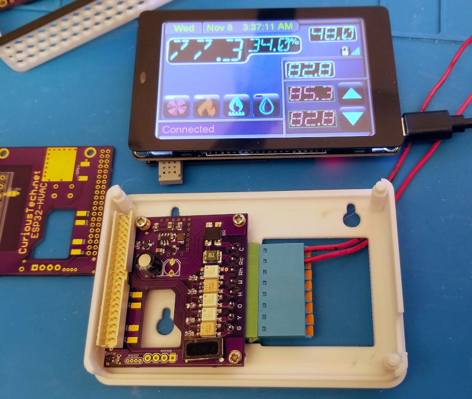

# WT32-SC01-HVAC
HVAC thermostat using WT32-SC01 (not PLUS)  [OSHPark Link](https://oshpark.com/shared_projects/ljZTJh9A) $15.65  
  
This is the 3rd thermostat I've designed, only becuase new hardware makes it better.  
All sensors from [ESP-HVAC](https://github.com/CuriousTech/ESP-HVAC) and older models can be used as remote units by compiling as REMOTE. This model can be changed to remote with just a temp/humidity sensor on the i2c pins, and use the USB for power.  
  
This first version just emulated the Nextion HMI and kept all the code the same, except for Display.cpp/h, removal of any ESP8266 specific code, and the addition of an I/O pin to power the H/T sensor for reset purposes since it shares the i2c with the touch interface.  
Encoder.cpp/h was removed, but can be added back easily, with 4 extra I/O pins for expansion (IO36 is input only).  
  
The WT32-SC01 can be purchased from many vendors. It stays fairly cool, but the LM1117 is a bit inefficient, with a quiescent current of 5mA. These 2 linear regulators can be replaced with something better such as the MIC5239-3.3YS-TR or AP2111H-3.3TRG1 to run it cooler. Soldering iron may be safer than a hot air gun unless the display is pulled away from the PCB (easy).
  
To pogram: Copy the User_Setup/Setup201_WT32_SC01.h over the original. Some paramters were incorrect.  
Uncomment #include "Setup201_WT32_SC01.h" and comment the default in TFT_eSPI/User_Setup_Select.h  
Flash over USB first, and upload the SPIFFS data using ESP32 Sketch Data Uploader.  
If any libraries are missing, the error should be on the line with a link to the library. Some are in my ESP-HVAC repo.  
  
Some lines in code to change:  
&nbsp;&nbsp;&nbsp;&nbsp; Thermostat.ino: Uncomment the temp sensor used.  
&nbsp;&nbsp;&nbsp;&nbsp; HVAC.h: Uncomment #define REMOTE to compile for remote units. RMT1 should be changed to a uniique ID for each remote.  
&nbsp;&nbsp;&nbsp;&nbsp; WebHandler.cpp: ipFcServer(192,168,31,100); is the local forecast server IP. This is a comma delimited file for the current temps on a local server.  
&nbsp;&nbsp;&nbsp;&nbsp; eeMem.h: This has the SSID/password (or use EspTouch to set up), web access password, and OpenWeatherMap city ID, and many other default EEPROM values.  
&nbsp;&nbsp;&nbsp;&nbsp; OpenWeaetherMap.h: #define APPID "app id" is the long string from OpenWeatherMap.  

First test of the booard came out almost perfect. The via close to the rectangle speaker can touch metal on the speaker and short. Use capton tape. It can go oon the bottom or top. Bottom is better. The right capacitor doesn't clear the ESP32, even at 7mm tall. It only needs about 100uF at 25V, but more is better. They can be mounted to the back if the case is redesigned, which I'm doing now.  

