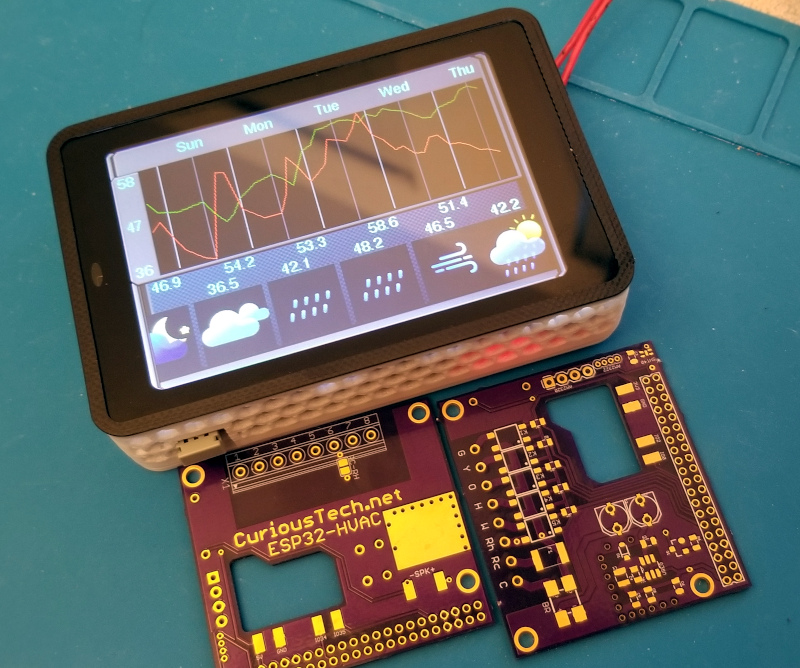

# WT32-SC01-HVAC
WiFi Smart Omniscient Opensource Arduino ESP32 HVAC Touchscreen Thermostat using WT32-SC01 (not PLUS)  OSHPark [Rev1](https://oshpark.com/shared_projects/ljZTJh9A) $15.65  [Rev2](https://oshpark.com/shared_projects/giHlVB41)  
  
This is the 3rd thermostat I've designed, only because new hardware makes it better, and tends to remove some limitations.  
All sensors from [ESP-HVAC](https://github.com/CuriousTech/ESP-HVAC), and older models can be used as remote units by building as REMOTE. This model can be changed to remote with just a temp/humidity sensor on the i2c pins, plus speaker if desired, and use the USB for power.  
  
This first version just emulated the Nextion HMI and kept all the code the same, except for Display.cpp/h, removal of any ESP8266 specific code, and the addition of an I/O pin to power the H/T sensor for reset purposes since it shares the i2c with the touch interface.  
Encoder.cpp/h was removed, but can be added back easily, with 4 extra I/O pins for expansion (IO36 is input only).  

The WT32-SC01 can be purchased from many vendors. It stays fairly cool, but the LM1117 is a bit inefficient, with a quiescent current of 5mA. These 2 linear regulators can be replaced with something better such as the AP2111H-3.3TRG1 to run it cooler. Soldering iron may be safer than a hot air gun unless the display is pulled away from the PCB (easy).  
  
To pogram: Copy the User_Setup/Setup201_WT32_SC01.h over the original. Some parameters were incorrect.  
Uncomment #include "Setup201_WT32_SC01.h" and comment the default in TFT_eSPI/User_Setup_Select.h  
Flash over USB first, and upload the SPIFFS data using ESP32 Sketch Data Uploader.  
If any libraries are missing, the error should be on the line with a link to the library. Some are in my ESP-HVAC repo.  
  
Some lines in code to change:  
&nbsp;&nbsp;&nbsp;&nbsp; Thermostat.ino: Uncomment the temp sensor used.  
&nbsp;&nbsp;&nbsp;&nbsp; HVAC.h: Uncomment #define REMOTE to compile for remote units. RMT1 should be changed to a uniique ID for each remote.  
&nbsp;&nbsp;&nbsp;&nbsp; WebHandler.cpp: ipFcServer(192,168,31,100); is the local forecast server IP. This is a comma delimited file for the current temps on a local server.  
&nbsp;&nbsp;&nbsp;&nbsp; eeMem.h: This has the SSID/password (or use EspTouch to set up), web access password, and OpenWeatherMap city ID, and many other default EEPROM values.  
&nbsp;&nbsp;&nbsp;&nbsp; OpenWeaetherMap.h: #define APPID "app id" is the long string from OpenWeatherMap.  
  
First test of the board came out almost perfect. The via close to the rectangle speaker can touch metal on the speaker and short. Use capton tape. It can go on the bottom or top. Bottom is better. The right capacitor doesn't clear the ESP32, even at 7mm tall. It only needs about 100uF at 25V, but more is better. They can be mounted to the back with the current case design.  
  
Thermal issues have been a struggle with this design, and the SHT40 is horrible sharing the i2c bus with the touchscreen. The AM2322 or AM2320 is a much better option. To reduce current, which effectively reduces heat, several changes were made: Setting clock to 80MHz instead of the default 240MHz, disabling the bluetooth radio, and lowering the LED backlight brightness (100 of 255) drops it from ~250mA to 150mA at 5V. Reducing the brightness further to 50 brings it down to ~80mA. At this point it produces very little heat, and is still almost bright enough for indoor visibility. 100 is really preferable.  
  
  
  
  
With the printed case. I added about 5 inches of black before the white to match the display face (just stuck in front, not fused).  
  
  
  
HVAC wiring labels:  
 C (blue) common 24VAC  
 Rc (red or orange) 24VAC power for cool  (C and Rc power the thermostat)  
 Rh (red) 24VAC power for heat. Solder the Rc-Rh jumper on the back if not used.  
 Y (yellow) cool signal  
 O (color varies) compressor reverse for heatpump 
 W (white) heat signal  
 G (green) fan signal. Note: Heat and cool override manual fan signal.  
 H humidifier  
  
Main page:  

Cool/heat low/high:  
These are the desired temperature ranges for cooling and heating, which are calculated based on outside temperature over the next set number of days if using forecast.  

Cycle:  Disable heat and cool, but still cycles the fan by the Auto Fan: Run: settings. 4:00 and 5 default = 5 minutes every 4 hours.  

Threshold:  
The temperature offset to complete a cycle.  

Pre-cycle fan time:  
0 disables, 1 second to 5 minutes.  This is the first phase of the cycle.  When the temperature reaches the target, the fan is turned on to cycle air for the set time, which causes the thermostat to read a more overall temperature. If the threshold is reached before this ends, which it can, it will shut off. Otherwise it continues to the run phase, which runs for at least the cycleMin period to save wear on the compressor because this does shorten the run time considerably.  A good value to use is the time it takes to lower the temperature after turning the fan on before it plateaus.  Usually around 2 minutes. Note: The compressor and furnace have built-in timers as well, so make sure it's above them or it can get out of sync.  

Post-cycle fan time:  
Runs fan after cycle completes. This is the third phase of the cycle, which continues to push air through the cold radiator and ductwork. 2 minutes is good, but you can use an IR thermometer on a vent to see how long the cold air continues.  

Humidifier settings:  
Off: Always off  
Fan: Run when fan is on  
Run: Run when thermostat is running a cycle  
Auto1: Operate by humidistat during run cycles  
Auto2: Humidistat runs independently of thermostat (shares fan control)  

Override:  
Use to heat or cool by a selected offset temperature for a specified time.  

Freshen:  
Starts the fan with a timeout.  This uses the post fan timer, so a normal cycle will cancel it.  

Idle min, cycle min/max:  
These are timers in seconds to control the thermostat operating limits.  Idle min is the shortest time between cycles.  Cycle min is the shortest time for a cycle, and max is the longest.  The compressor has its own timers, so too short can get out of sync with the operation.  

Away time and temperature delta offset:  
The away time is in hours:minutes unlike the rest of the timers, but uses the override timer.  It can be turned on and off with the button, but will also turn off with the timer.  There are 2 temp values that are displayed depending on heat or cool mode.  One for heat and one for cool, like the pre/post fan.
Like any setting, it can be automated with something like Tasker.  To turn on would be <b>http://ip/s?key=password&away=1</b>  

Other settings:  
AC differential limit: Increases thermostat if inside/outside difference is more than 20. This assumes Fahrenheit. Change for Celsius.  
Heat Threshold: Heatpump will switch off and use gas when outside temp goes below set value (default 33). Change for Celsius.  
PKW (price per kilowatt hour), CFM (gas cubic feet per minute), CCF (cost per 100 cubic foot): Set the PPKW and CCF based on billing. CFM is dependent on the furnace.  
FC Shift (in minutes): Shifts the forecast for the temperature adjust. Use the setting on the chart page (they don't affect the actual settings) to determine what's best. There are 2 values for heat and cool here as well.   
Lookahead is for the forecast data. 23*3 hours default is a good range to find peaks in the current forecast. Disp is the amount to display on the unit.  
Brightness is the dim and bright backlight levels.  
Temp Weight is the weight of the internal temp sensor vs. remote sensors.  Set them higher in rooms you're more often using or set by occupancy sensor if used.  Cal is calibration of the temp sensor. 
Pri/En: En enables each sensor to be weighted averaged, and Pri increases the weight.  

  

The web chart.  Dark gray is off, cyan is fan running, blue is compressor+fan, NG is red, HP is yellow, rh is green, the target/threshold is the wave.  The thermostat is in the hottest room in the house, so it does look warmer than it really is, but that's why there's a remote unit, and now multiple sensors.  
  

Sensor web page  
  
